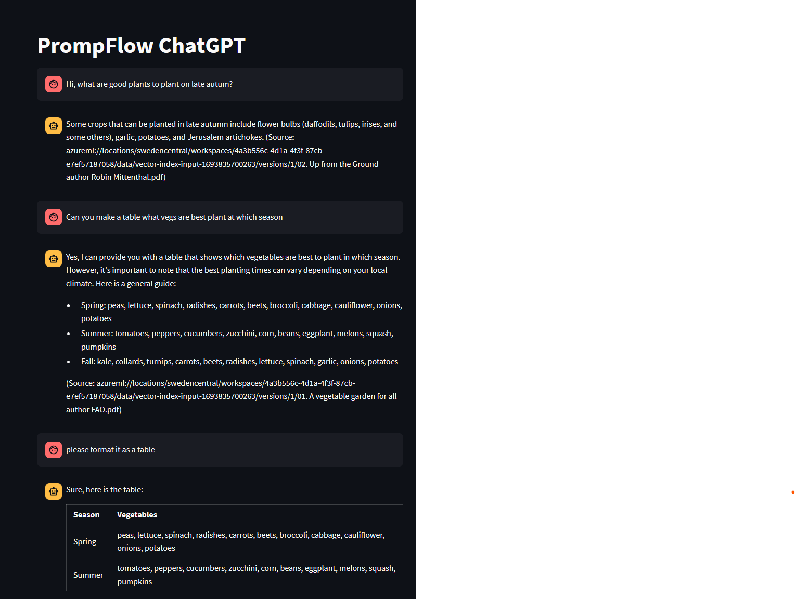

# Custom chat for Azure PromptFlow "Bring Your Own Data Chat QnA" example

This is a custom streamlit chat for Azure PromptFlow starter 'Bring Your Own Data Chat QnA'.
It adapts the streamlit open-ai-chat component to work with the interface of the example.

## Usage

Following env variables are needed to be configured:

- URL=https://MYDEPLOYMENT.REGION.inference.ml.azure.com/score
- KEY=APIKEYFORDEPLOYMENT
- MODEL=MODELNAME